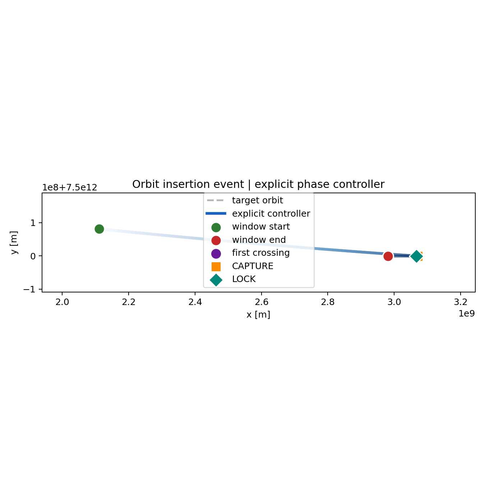
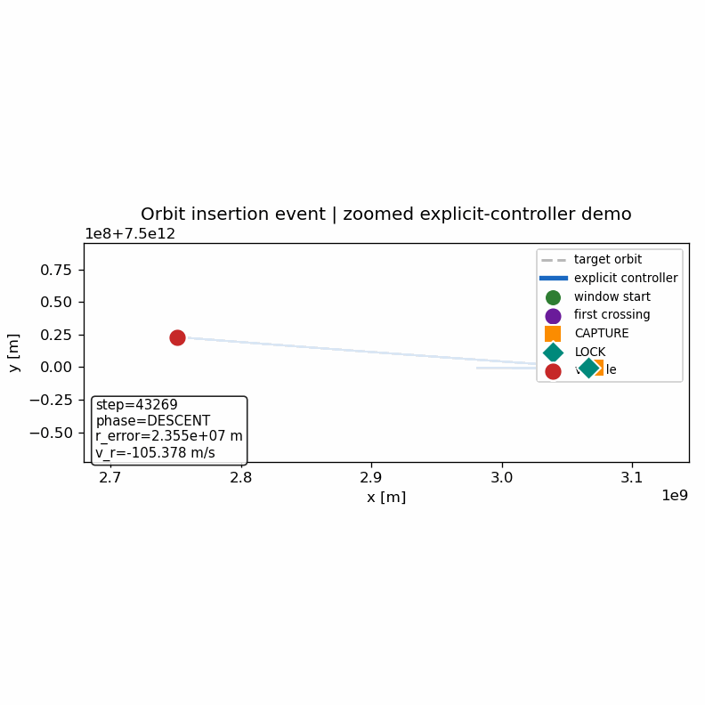
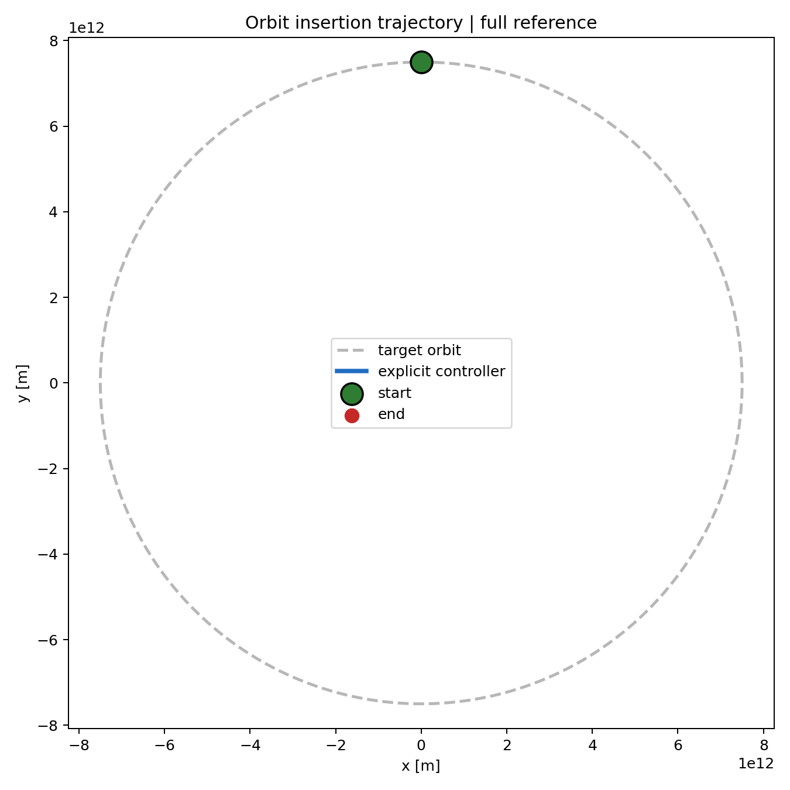

# AI-Controlled Spacecraft Orbital Simulator

This repository is a 2D physics-based orbital control sandbox for studying orbit-insertion control under thrust limits. It began as a comparison between PPO policies, probe baselines, and explicit controllers, then evolved into an explicit controller research platform for understanding when a trajectory is actually recoverable.

The current research conclusion is:

> First crossing is not orbital insertion.

Successful insertion in this sandbox requires:

```text
crossing -> post-cross smooth synchronization -> recoverability basin -> survival
```

Phase34 is the current architecture result. It does not solve the entire orbital insertion problem, and it is not a real spacecraft controller. It shows that, for trajectory families that already produce a target-radius crossing, adding a post-cross synchronization mode can convert those crossings into recoverable cases.

## Demo & Visual Overview

The fastest way to understand this repository is to inspect the insertion event directly. The demo below shows a simulator-successful explicit-controller sandbox insertion sequence. It is control-architecture evidence from a 2D simulator, not flight validation.

Verified demo summary:

- success: `true`
- radius crossings: `1`
- first crossing step: `48,269`
- final radius error: `27,657.63 m`
- phase transitions: `DESCENT -> CAPTURE`, `CAPTURE -> LOCK`

### Primary Insertion Event



### Dynamic Zoomed Insertion Window



### Full Trajectory Reference



## Visual Interpretation

These visuals represent the core control-science distinction explored throughout this project:

- Crossing target radius is not equivalent to orbital insertion.
- A trajectory may visually "reach" the orbit but still fail recoverability.
- The important structure is:

```text
crossing -> post-cross correction -> recoverability -> CAPTURE -> LOCK
```

Interpretation of the simulator labels:

- Crossing: a geometric event where the trajectory crosses the target radius.
- Recoverability: dynamic viability, where radius, radial velocity, and tangential velocity can be brought into a survivable basin.
- CAPTURE: the simulator insertion regime has been entered.
- LOCK: the simulator stabilized regime has been entered.

What to look for in weaker architectures such as PPO and early heuristics:

- radius approach without stable insertion
- one-sided drift
- unstable or non-recoverable crossing

What to look for in stronger architectures such as Phase34 post-cross synchronization:

- crossing-producing transfer
- smooth post-cross correction
- radius, radial-velocity, and tangential-velocity synchronization
- recoverable trajectory family

## Why This Matters

This repository is not primarily about making a spacecraft touch a target orbit.

It is about understanding:

> What control architecture converts geometric success into dynamically survivable insertion?

The visuals above should be interpreted as control-architecture evidence, not flight-readiness evidence.

## Project Overview

The project tests control architectures in a simplified planar orbital environment. The environment tracks radius, radial velocity, tangential velocity, thrust-limited control, target-radius crossing, CAPTURE, LOCK, and simulator-defined survival criteria.

The main controller families explored so far are:

- PPO and imitation-learning policies
- probe and heuristic descent baselines
- staged explicit controllers with named control phases
- global transfer templates and Burn-A/B variants
- direct optimal-control prototypes
- post-cross synchronization controllers

Earlier README versions emphasized Phase7.6 because it was the strongest local explicit-controller milestone. Later phases changed the scientific framing. The central question is no longer only whether a controller can reach or cross the target radius. The current question is whether the resulting state enters a recoverability basin where radius, radial velocity, and tangential velocity can be jointly stabilized.

## Research Question

Can a thrust-limited controller perform orbital insertion in a 2D simulator by producing not just a target-radius crossing, but a recoverable post-cross state?

More concretely, the project asks:

- Which trajectory families produce target-radius crossings?
- Which crossings are inside or near the recoverability basin?
- Why do window creation, crossing count, and CAPTURE entry fail as standalone success metrics?
- What controller architecture is needed after the first crossing?
- Can explicit controllers approximate the useful structure found by optimal control?

The working definition of recoverability is stricter than radius crossing. A recoverable state must bring these quantities into simultaneous alignment:

```text
radius near target
radial velocity near zero
tangential velocity near circular
```

## Key Discovery

The main discovery is that first crossing is not insertion.

Many controllers can be tuned to create windows or crossings, but the first crossing state can still be dynamically unrecoverable. Phase33 showed this clearly by decomposing the best Phase32 optimal-control trajectory:

- first target-radius crossing occurred early
- the first crossing state was still outside the recoverability basin
- the best recoverable state occurred much later
- the missing behavior was a smooth low-thrust post-cross synchronization arc

This changed the project from crossing-targeting to recoverability research. The important event is not simply touching the target radius. The important sequence is crossing, then continuous synchronization of radius, radial velocity, and tangential velocity until the trajectory enters the recoverability basin and survives.

## Architecture Evolution

The project's development path can be read as a sequence of increasingly specific hypotheses about the bottleneck.

Early PPO and baseline experiments tested whether a learned reactive policy could solve insertion directly. In the validated comparisons, PPO did not reliably reach the first crossing. Behavior cloning and short PPO fine-tuning from explicit-controller data also failed to recover the explicit phase structure. This suggested that the problem was not just reward tuning or model capacity; it had an architecture-level bottleneck.

Phase6.5 through Phase7.6 established that explicit phase structure matters in the local reachable regime. The best Phase7.6 controller, `soft_linear_3e4`, used coordinated pre-window shaping, window-seeking, CAPTURE, and LOCK behavior and reached `217 / 270` strict simulator success labels on its local 2D grid. That was a strong local milestone, but Phase8 and later phases showed that it did not solve global reachability.

Phases15 through Phase19 tested local and semi-planned fixes: oscillation forcing, trajectory tracking, elliptical transfer targets, crossing-state targeting, and minimal burn/coast planning. These variants clarified failure modes but did not expand recoverability. The lesson was that local heuristics cannot solve a global reachability and phasing problem.

Phases28 through Phase31 moved from controller tuning to trajectory-family analysis. They separated dead windows, window-no-crossing cases, crossing-bad-sync cases, and near-recoverable crossings. Burn-A family selection, endpoint search, and named global transfer families changed geometry but did not create recoverable crossings.

Phase32 introduced a finite-horizon direct optimal-control prototype. CasADi/IPOPT was not available in the checked runtime, so this phase used SciPy direct shooting rather than full CasADi/IPOPT direct collocation. Even as a coarse prototype, it showed that recoverable states were physically reachable under the unchanged 2D dynamics.

Phase33 extracted the structure of the best Phase32 trajectory. The key mechanism was not a better first crossing. It was post-cross smooth synchronization.

Phase34 then tested that extracted structure as an explicit controller modification.

## Phase34 Architecture Result

Phase34 preserved the Phase22/31-style early transfer behavior and inserted a post-cross synchronization mode after the first target-radius crossing. Physics, reward, thresholds, CAPTURE, and LOCK rules were not relaxed.

The Phase34 result is narrow but important:

- it is a post-cross architecture test built on Phase22/31-style early transfer behavior
- it should be judged on crossing-producing cases
- it does not solve non-crossing trajectory families
- it does not prove full end-to-end universal insertion

On the reduced Phase34 comparison, the baseline Phase31-style mode produced crossings but no recoverable crossings. The best Phase34 mode, `radius_priority`, converted every crossing-producing case in that benchmark into a recoverable case and a simulator-defined success label.

The quantitative headline is:

| Metric | Phase31-style baseline | Phase34 best mode |
|---|---:|---:|
| Cases | 24 | 24 |
| Crossings | 8 | 8 |
| Recoverable crossings | 0 | 8 |
| Simulator success label | 8 | 8 |
| Crossing-case best distance | 3.9923 | 0.9855 |
| Overspeed | 0 | 0 |

“Success” here refers to the simulator-defined success label, not real spacecraft mission success.

Important interpretation: in Phase34, "recoverable crossing" means a trajectory crossed and later reached a recoverable state during the post-cross synchronization arc. It does not mean the first crossing state itself was already recoverable.

Primary Phase34 artifacts:

- [Phase34 summary](analysis/phase34_post_cross_sync/summary.md)
- [Phase34 vs Phase31 comparison](analysis/phase34_post_cross_sync/phase34_vs_phase31_comparison.md)
- [Phase34 results CSV](analysis/phase34_post_cross_sync/phase34_results.csv)
- [Mode comparison plot](analysis/phase34_post_cross_sync/mode_comparison.png)
- [Post-cross sync examples](analysis/phase34_post_cross_sync/post_cross_sync_examples.png)
- [Phase31 vs Phase34 overlay](analysis/phase34_post_cross_sync/phase31_vs_phase34_overlay.png)

## Results Summary

The strongest current evidence is the progression from Phase31 to Phase34:

- Phase31 and related transfer architectures could produce crossings, but produced `0` recoverable crossings.
- Phase32 showed, with SciPy direct shooting, that recoverable states were reachable under the same physics.
- Phase33 identified the missing controller motif: a smooth post-cross synchronization arc.
- Phase34 implemented that motif in an explicit controller and improved crossing-producing cases from `8` crossings / `0` recoverable crossings to `8` crossings / `8` recoverable crossings.

The project's strongest current claim is therefore architecture-level, not deployment-level:

> In this 2D sandbox, crossing-producing trajectories require post-cross synchronization before they can be treated as recoverable orbital insertion attempts.

What is supported:

- PPO did not solve the validated crossing/insertion task in the current evidence trail.
- Simple heuristic crossing control and named transfer templates were insufficient.
- Direct optimal control exposed recoverability as physically reachable in representative cases.
- Phase34's explicit post-cross synchronization closes the recoverability gap for crossing-producing cases in its reduced benchmark.

What is not supported:

- full orbital autonomy
- real spacecraft readiness
- universal success across all initial conditions
- solving non-crossing trajectory families
- claiming that the first crossing state is already insertion

## Current Limitations

This is a simulation project in a simplified 2D orbital environment. It is useful for studying control structure, but it is not a validated spacecraft guidance, navigation, and control system.

Current limitations:

- Phase34 only solves crossing-producing cases in the tested reduced benchmark.
- Non-crossing trajectory families remain unsolved.
- Phase34 improves crossing-case best distance, but all-case mean distance is still dominated by non-crossing families.
- The controller is hand-built and explicit; it is not a learned universal policy.
- Phase32 used SciPy direct shooting because CasADi/IPOPT was unavailable in the checked runtime.
- CAPTURE, LOCK, and success criteria are simulator-specific and should not be interpreted as flight-readiness metrics.
- The environment is planar and simplified; it does not include full 3D orbital mechanics, real navigation uncertainty, actuator constraints, or operational safety validation.

## Current Research Status (May 2026)

Latest completed phases:

- Phase36B: Transfer-family benchmark
- Phase36C: Non-crossing geometry diagnosis

Key finding:

- Phase34 solved post-cross recoverability.
- Phase36B showed multiple transfer families converge to the same crossing basin.
- Phase36C showed the current bottleneck is upstream crossing-generation rather than post-cross stabilization.

Current research question:

Which parameterized transfer trajectory can generate new Phase34-compatible crossings among the remaining 16 / 24 non-crossing cases?

## Next Steps

Phase36B and Phase36C completed the next diagnostic step for crossing-basin expansion.

Phase36B tested four upstream transfer families on the full reduced benchmark, but none expanded the crossing set beyond the Phase34 baseline. Phase36C then isolated the remaining `16 / 24` baseline non-crossing cases and showed that closest-approach and crossing-potential metrics can move without producing new crossings.

The next direction is a small parameterized planner-level transfer search for upstream crossing-generation:

- search a coarse grid over transfer timing and shaping variables
- measure geometric crossing and Phase34-compatible handoff separately
- preserve Phase34 post-cross synchronization as the fixed local terminal controller
- defer MPC-lite until the transfer search reveals geometry worth exploiting

The guiding question is:

> Which parameterized transfer trajectory creates a target-radius crossing that can hand off into Phase34 recovery?

## Long-Term Vision

This repository is currently a 2D orbital insertion research sandbox, but its long-term purpose is broader: to build staged control-architecture foundations for increasingly realistic spacecraft autonomy across complex space environments. The durable contribution is not any single algorithm, PPO checkpoint, heuristic controller, or phase script. Algorithmic obsolescence is expected. Architecture principles are the durable contribution: survival over optimization, explicit failure recognition, and control logic that can refuse false progress.

Future scaling is not just "a bigger orbit." It is a progression from a single clean orbit into chaotic environments, partially modeled physics, degraded information, deep uncertainty, and expanding mission complexity. The path is:

```text
single clean orbit -> real spacecraft -> real space -> system-level autonomy
```

### Stage 1 — Current Foundation (Present)

The current project establishes the first layer of control-science primitives in a 2D Newtonian orbital sandbox. It compares PPO, imitation, probe baselines, and explicit controller families under the same simplified physics, then uses failures to identify architecture bottlenecks. The emphasis is control-science over benchmark chasing.

The key present-stage results are:

- PPO and direct heuristic crossing control are insufficient in the validated task trail.
- First crossing is not insertion.
- Recoverability requires crossing, post-cross synchronization, recoverability basin entry, and survival.
- The recoverability basin is a joint condition on radius, radial velocity, and tangential velocity.
- Phase34 shows that post-cross synchronization can convert crossing-producing cases into recoverable cases.

This stage establishes control logic primitives, not final spacecraft autonomy. Its value is in discovering the architecture-level distinction between touching a target orbit and entering a recoverable insertion regime.

### Stage 2 — Simulation Realism Expansion (Near-Term)

The next engineering step is to move from sandbox controller science toward an engineering-grade astrodynamics autonomy platform. That requires expanding both simulation fidelity and software performance.

Core simulator upgrades:

- C++ simulation core for rollout speed, larger sweeps, and long-horizon experiments
- 3D orbital mechanics
- full state vectors covering position, velocity, and orientation
- translational and rotational coupling
- attitude dynamics and attitude-control authority
- modular sensor and estimator models

Physics and environment realism:

- J2 / oblateness
- atmospheric drag
- solar radiation pressure
- thrust degradation
- mass depletion
- communication delay
- sensor uncertainty

Orbital-domain expansion:

- LEO
- MEO
- GEO
- HEO
- cislunar - interplanetary transfer

Propulsion backend modularity:

- chemical propulsion
- ion propulsion
- electric propulsion
- solar sail models
- speculative future backend placeholders

Fault injection:

- actuator asymmetry
- fuel faults
- navigation corruption
- partial subsystem loss

The important design rule is that propulsion is a backend, not the identity of the autonomy architecture. Propulsion, communication, and materials limitations remain hard constraints. Better propulsion may compress mission time scales, but it does not remove the need for robust control architecture, uncertainty handling, or final veto power.

### Stage 3 — Complex Space Environment Architecture (Mid-Term)

The mid-term research target is complex realistic universe-space conditions. The objective shifts from finding an optimal orbit to persistent operation in hostile, uncertain space.

This stage introduces environments where clean single-body assumptions no longer dominate:

- multi-body gravitational systems
- Earth-Moon-Sun interactions
- Lagrange regions
- planetary flybys
- asteroid fields
- debris environments
- uncertain terrain and landing windows
- sparse communication zones
- dynamic mission objectives
- long-horizon uncertainty
- radiation exposure constraints
- resource scarcity
- adversarial environmental complexity, meaning hostile physics rather than warfare

The autonomy architecture must therefore include:

- onboard autonomy for local decisions under communication delay
- mission-layer planning for intent, constraints, and long-horizon tradeoffs
- world-model uncertainty rather than a single trusted prediction
- trust decay when prediction and observation diverge
- failure mode labeling so the system can identify how it is failing
- survival-first autonomy when optimization becomes unsafe
- final veto power: the ability to suspend or refuse an optimization path that has become dangerous

At this stage, the Phase34 lesson remains relevant in a larger form. First crossing is not insertion becomes a general systems rule: reaching an intermediate milestone is not the same as entering a recoverable operational regime.

### Stage 4 — Distributed Autonomous Space Systems (Advanced Mid/Far-Term)

Advanced autonomy should not mean one centralized world model commanding many passive agents. Distributed execution ≠ distributed cognition.

Distributed execution means many spacecraft carry out commands from a shared planner. Distributed cognition means different nodes maintain distinct hypotheses, risk tolerances, degradation strategies, and local interpretations of uncertain evidence. True distributed autonomy requires cognitive diversity, not just networked control.

This stage studies:

- multi-agent spacecraft coordination
- probe fleets
- distributed sensing
- structured divergence
- non-uniform world models
- anti-correlated failure design
- orbital intelligence hub architectures
- Earth + orbital + deep-space layered cognition
- swarm resilience
- mission continuity under node loss

The purpose of structured divergence is to avoid correlated failure. If every spacecraft trusts the same model in the same way, then every spacecraft can fail in the same direction at the same time. A resilient fleet should preserve disagreement, label uncertainty, and maintain multiple degradation pathways.

An orbital intelligence hub may aggregate data, compress plans, and relay mission updates, but it must also act as an auditor. It should detect model drift, policy invalidation, and confidence collapse. Its role is not only to plan, but to doubt planning when the environment leaves the assumed distribution.

### Stage 5 — Concept Horizon (Far-Term)

This stage is conceptual horizon planning, not current implementation.

The far-term idea is to keep the autonomy architecture scalable under improved propulsion, communication, and materials assumptions. Future propulsion should be treated as backend substitution, not the core identity of the project. A chemical engine, electric thruster, ion drive, solar sail, or more speculative backend should plug into the same higher-level architecture: model uncertainty, recoverability reasoning, survival-first control, failure labeling, and final veto power.

Possible far-term research directions include:

- scalable autonomy architectures under improved propulsion assumptions
- modular propulsion abstraction across conventional and future backends
- AI-assisted human exploration support
- robotic precursor systems that map hazards before crewed missions
- sustainable exploration continuity
- civilization-scale exploration systems under explicit physical and institutional assumptions

This roadmap does not claim that the current repository solves real spacecraft autonomy, deep-space exploration, distributed cognition, or human exploration support. It defines a staged path for how the control-architecture ideas discovered in a simplified orbital setting could be expanded and stress-tested under progressively more realistic constraints.

This repository is not the final spacecraft autonomy system. It is the control-architecture seed: a progressively expanding foundation from simplified orbital logic toward resilient autonomy in increasingly realistic and hostile space environments.

## How to Run

Recommended environment:

```bash
conda env create -f environment.yml
conda activate spacecraft
```

Linux-first migration setup:

```bash
git clone https://github.com/Sean-ZhiXin-Li/spacecraft-ai-controller.git
cd spacecraft-ai-controller
conda env create -f conda_envs/spacecraft_linux.yml
conda activate spacecraft-linux
export MPLBACKEND=Agg
python -m pytest -q Tests/test_env_smoke.py Tests/test_quickrun_smoke.py
```

The Linux manifest is a CPU baseline for migration validation. Add
machine-specific CUDA support only after the smoke checks pass. See the
[Linux migration guide](docs/linux_migration.md) for the full checklist,
entry points, and known risks.

Minimal manual setup, if not using Conda:

```bash
pip install numpy matplotlib torch pillow gymnasium scikit-learn
```

Generate the current demo assets:

```bash
python main.py
```

Equivalent direct demo command:

```bash
python scripts/generate_orbit_demo.py
```

Re-run the Phase34 post-cross synchronization benchmark:

```bash
python scripts/explicit_controller_phase34_post_cross_sync.py
```

Re-run the supporting Phase31 to Phase33 research trail:

```bash
python scripts/explicit_controller_phase31_global_transfer_solver.py
python scripts/phase32_direct_optimal_control.py
python scripts/phase33_optimal_structure_extraction.py
```

Earlier local-controller milestones can be reproduced with:

```bash
python scripts/explicit_controller_phase76_soft_hybrid.py
python scripts/explicit_controller_phase8_multiregime_map.py
```

The PPO and behavior-cloning transfer checks are available through:

```bash
python scripts/train_behavior_cloning.py
python scripts/eval_bc_policy.py --policy-kind bc --checkpoint models/bc_policy.pth
python scripts/eval_bc_policy.py --policy-kind ppo --checkpoint models/ppo_bc_finetuned.pth
```

## Repository Structure

```text
spacecraft_ai_project/
├── analysis/               # summaries, figures, benchmark outputs, datasets
├── controller/             # explicit, probe, PPO-related controllers
├── envs/                   # orbital environment and task definitions
├── models/                 # saved BC and PPO-transfer models
├── ppo_orbit/              # PPO implementation
├── project_log/            # sprint logs and phase narratives
├── scripts/                # evaluation, sweeps, plotting, demo generation
├── main.py                 # demo entry point
└── README.md
```

## Recommended Reading

For the current research narrative, read:

1. [Phase34 summary](analysis/phase34_post_cross_sync/summary.md)
2. [Phase34 vs Phase31 comparison](analysis/phase34_post_cross_sync/phase34_vs_phase31_comparison.md)
3. [Phase33 summary](analysis/phase33_optimal_structure_extraction/phase33_summary.md)
4. [Phase33 structure decomposition](analysis/phase33_optimal_structure_extraction/structure_decomposition.md)
5. [Sprint log Phase28 to Phase33](project_log/sprint_ppo28-33.md)
6. [Sprint log PPO22 to PPO27](project_log/sprint_ppo22-27.md)

For older local-controller context:

1. [Phase7.6 soft-hybrid summary](analysis/phase76_soft_hybrid/phase76_summary.md)
2. [Phase8 multi-regime summary](analysis/phase8_multiregime/phase8_summary.md)
3. [Phase8-19 research summary](analysis/phase8_to_19_research_summary.md)

## License

MIT License. See [LICENSE](LICENSE).
