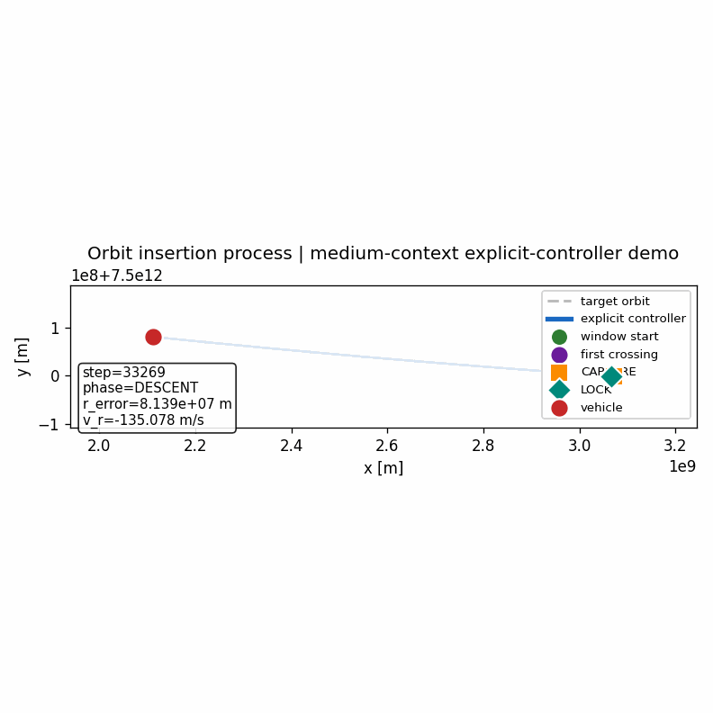
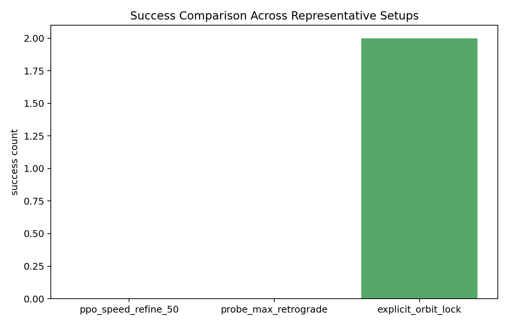
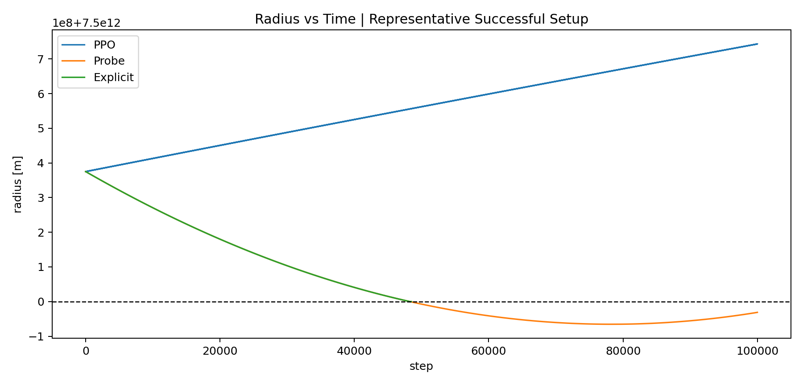

# AI-Controlled Spacecraft Orbital Simulator

Physics-grounded spacecraft control research for orbit insertion under thrust limits.

This repository compares three control families under the same orbital environment:

- PPO policies
- simple probe baselines
- an explicit phase-structured controller

The current best verified result is not PPO. It is a hand-designed **phase-structured explicit controller** that performs:

1. pre-window trajectory shaping
2. window-seeking
3. `CAPTURE`
4. `LOCK`

in sequence.

## Final Project Status

The current best controller is `soft_linear_3e4` from Phase 7.6:

- 217 / 270 strict successes
- 217 CAPTURE entries
- 8 near-misses

This is the best verified result in the repository's 2D local orbit-insertion grid. It beats the prior references:

| Controller | Phase | Successes | CAPTURE entries | Near-misses |
|---|---:|---:|---:|---:|
| `adaptive_soft` | 6.7 | 172 | 172 | 44 |
| `prewindow_radial_medium` | 7.0 | 209 | 209 | 56 |
| `hard_hybrid_1e4` | 7.5 | 170 | 170 | 42 |
| `soft_linear_3e4` | 7.6 | 217 | 217 | 8 |

Core conclusion:

> Orbit insertion in this 2D setting is not solved by reactive learning or static gain tuning. It requires phase-structured continuous coordination: pre-window shaping + window-seeking + capture/lock stabilization.

Primary Phase 7.6 artifacts:

- [Phase 7.6 summary](analysis/phase76_soft_hybrid/phase76_summary.md)
- [Phase 7.6 ranking](analysis/phase76_soft_hybrid/soft_hybrid_ranking.csv)
- [Soft-hybrid comparison plot](analysis/phase76_soft_hybrid/soft_hybrid_comparison.png)
- [Soft-hybrid success map](analysis/phase76_soft_hybrid/soft_hybrid_success_map.png)

## Current Project Result

The project now has a **working explicit insertion controller family** whose best member is the Phase 7.6 soft hybrid. It reaches target-radius crossing, enters CAPTURE, and achieves strict success in 217 of the 270 tested local 2D regimes.

What is supported by the repository outputs:

- PPO baseline does not reach the first crossing on the validated baseline.
- A pure retrograde probe can force one crossing, but does not stabilize afterward.
- Explicit phase-structured controllers are the only controllers here that both:
  - reach the first crossing
  - satisfy the project's strict success criterion in successful setups
  - improve substantially when pre-window shaping and window-seeking are continuously coordinated

What is **not** currently supported:

- repeated sustained orbit-lock cycling across the target radius
- successful PPO transfer of the explicit phase structure
- claims beyond the tested 2D local grid

Those statements are grounded in:

- [analysis/final_project_summary.md](analysis/final_project_summary.md)
- [analysis/phase76_soft_hybrid/phase76_summary.md](analysis/phase76_soft_hybrid/phase76_summary.md)
- [analysis/orbit_lock_benchmark.md](analysis/orbit_lock_benchmark.md)
- [analysis/orbit_lock_generalization.md](analysis/orbit_lock_generalization.md)
- [analysis/ppo_transfer_results.md](analysis/ppo_transfer_results.md)

## Key Insight

Orbit insertion in this system is not a single continuous control problem.

It is a **phase-structured process** requiring:

- pre-window trajectory shaping
- window-seeking near target radius
- energy removal (descent)
- post-crossing capture
- near-orbit stabilization

Controllers that do not explicitly represent this structure fail,
even if they have sufficient capacity (e.g., PPO).

## Demo

Running the project entry now generates a real orbital demo animation for the best successful explicit-controller setup.

```bash
python main.py
```

This produces:

- [analysis/demo/orbit_demo.gif](analysis/demo/orbit_demo.gif)
- [analysis/demo/orbit_demo_full.png](analysis/demo/orbit_demo_full.png)
- [analysis/demo/orbit_demo_trajectory.png](analysis/demo/orbit_demo_trajectory.png)
- [analysis/demo/orbit_demo_summary.json](analysis/demo/orbit_demo_summary.json)

Animated demo:



Full-orbit reference for global geometric context:


Zoomed insertion-event view for local control behavior around crossing, capture, and lock:


The demo uses the validated explicit-controller setup:

- `r0_over_target = 1.00005`
- `dt = 100`
- `max_steps = 100000`
- `thrust_scale = 10000`

## Why PPO Fails

PPO fails here for structural reasons, not just weak tuning.

Observed failure pattern:

- PPO behaves as a single continuous reactive policy.
- It does not reliably produce the control-phase transition needed for:
  - descent
  - post-crossing capture
  - final lock
- In the validated comparisons, it does not reach the first crossing on the main baseline.

Evidence:

- benchmark successes: explicit `2 / 3`, probe `0 / 3`, PPO `0 / 3`
- transfer result: BC and short PPO fine-tuning still fail to recover first crossing

See:

- [analysis/orbit_lock_benchmark.md](analysis/orbit_lock_benchmark.md)
- [analysis/ppo_transfer_results.md](analysis/ppo_transfer_results.md)

## Why Probe Is Not Enough

The `probe_max_retrograde` controller is useful because it proves physical reachability in the reachable regime, but it is still only a descent baseline.

It can:

- remove orbital energy aggressively
- force one crossing in reachable conditions

It cannot:

- switch behavior after crossing
- capture and stabilize the orbit

So it is a reachability tool, not a full insertion controller.

## Why the Explicit Controller Works

The explicit controller works because it is **phase-structured**.

It does not use one feedback law for the entire insertion process. Instead it switches between:

1. `DESCENT`
   - full retrograde thrust aligned with velocity
   - objective: guarantee first crossing
2. `CAPTURE`
   - damp radial motion after crossing
   - restore tangential support
3. `LOCK`
   - apply smaller near-orbit stabilization

This project's main lesson is:

> orbit insertion is not one homogeneous control problem; it is a sequence of control phases

## Benchmark And Generalization

### Final benchmark comparison

Representative benchmark result summary:



This comparison plot shows strict success counts across the three representative benchmark setups used in the final benchmark pass.

More detail:

- [analysis/orbit_lock_benchmark.md](analysis/orbit_lock_benchmark.md)
- [analysis/figs/orbit_lock_benchmark/aggregate_results.json](analysis/figs/orbit_lock_benchmark/aggregate_results.json)

### Representative controller comparison on a successful setup

The following plot is a controller-comparison diagnostic on one representative successful setup, not a complete characterization of the full physical system.



Related radial-velocity diagnostic:

- [analysis/figs/final_project/final_project_plot_summary.json](analysis/figs/final_project/final_project_plot_summary.json)
- [analysis/figs/final_project/v_r_vs_time.png](analysis/figs/final_project/v_r_vs_time.png)

These 2D diagnostics are used to illustrate controller behavior and compare control regimes. They are useful validation views, but they are not a full physical system characterization by themselves.

### Generalization takeaway

The explicit controller generalizes, but only in a narrow reachable regime.

Verified result:

- success in `5 / 36` tested setups
- working region is limited to:
  - very small initial radius offsets
  - moderate or large `dt`
  - moderate thrust, not maximal thrust

See:

- [analysis/orbit_lock_generalization.md](analysis/orbit_lock_generalization.md)
- [analysis/figs/orbit_lock_generalization/aggregate_results.json](analysis/figs/orbit_lock_generalization/aggregate_results.json)

## Learning Transfer Status

The repository already includes the first learning-transfer stage:

1. behavior cloning from the explicit phase controller
2. short PPO fine-tuning from the cloned policy

Current status:

- explicit controller: crossing `1`, success `true`
- behavior cloning: crossing `0`, success `false`
- PPO fine-tuned from BC: crossing `0`, success `false`

So the explicit structure is solved, but the learned transfer is not solved yet.

Relevant files:

- [analysis/phase_controller_dataset.md](analysis/phase_controller_dataset.md)
- [analysis/ppo_transfer_results.md](analysis/ppo_transfer_results.md)
- [analysis/phase_controller_dataset/phase_controller_dataset_balanced.npz](analysis/phase_controller_dataset/phase_controller_dataset_balanced.npz)

## Phase 3 Hybrid Residual Status

Phase 3 tested whether learning can safely refine the explicit controller without replacing its control structure.

Current result:

- zero-residual hybrid exactly preserves explicit-controller success
- alpha sweep shows no behavioral change when the residual output is zero
- tiny unconstrained nonzero residual tuning harmed success
- magnitude-only residual keeps the explicit action direction, but nonzero magnitude bias did not improve the accepted checkpoint

The Phase 3 conclusion is conservative: hybrid learning should preserve the explicit controller as the primary structure and only accept residual authority when rollout evidence shows both success preservation and objective improvement.

See:

- [analysis/residual_explicit_il_result.md](analysis/residual_explicit_il_result.md)
- [analysis/residual_explicit_alpha_sweep_result.md](analysis/residual_explicit_alpha_sweep_result.md)
- [analysis/residual_explicit_tune_result.md](analysis/residual_explicit_tune_result.md)
- [analysis/residual_explicit_magnitude_only_result.md](analysis/residual_explicit_magnitude_only_result.md)

## Current 2D Deep-Dive Diagnostics

The latest same-scenario explicit-controller diagnostics characterize the local basin, timestep sensitivity, perturbation robustness, and phase-wise mechanism without changing the core 2D problem.

Key artifacts:

- [analysis/final_phase3_summary_v2.md](analysis/final_phase3_summary_v2.md)
- [analysis/final_phase3_audit_v2.md](analysis/final_phase3_audit_v2.md)
- [analysis/phase_map_v2/phase_map_v2.csv](analysis/phase_map_v2/phase_map_v2.csv)
- [analysis/phase_map_v2/success_heatmap_v2.png](analysis/phase_map_v2/success_heatmap_v2.png)
- [analysis/phase_map_v2/boundary_refine_summary_v2.md](analysis/phase_map_v2/boundary_refine_summary_v2.md)
- [analysis/dt_mechanism/dt_mechanism_summary.md](analysis/dt_mechanism/dt_mechanism_summary.md)
- [analysis/phase4_regime/phase4_regime_summary.md](analysis/phase4_regime/phase4_regime_summary.md)
- [analysis/phase5_reachability_summary.md](analysis/phase5_reachability_summary.md)
- [analysis/mechanism_compare_v2/mechanism_compare_summary_v2.md](analysis/mechanism_compare_v2/mechanism_compare_summary_v2.md)
- [analysis/phase_map/phase_map.csv](analysis/phase_map/phase_map.csv)
- [analysis/phase_map/success_heatmap.png](analysis/phase_map/success_heatmap.png)
- [analysis/phase_map/boundary_refine_summary.md](analysis/phase_map/boundary_refine_summary.md)
- [analysis/mechanism_compare/mechanism_compare_summary.md](analysis/mechanism_compare/mechanism_compare_summary.md)
- [analysis/mechanism_compare/phase_duration_table.json](analysis/mechanism_compare/phase_duration_table.json)
- [analysis/robustness_quick_check.md](analysis/robustness_quick_check.md)
- [analysis/final_phase3_summary.md](analysis/final_phase3_summary.md)
- [analysis/next_stage_recommendation.md](analysis/next_stage_recommendation.md)

## Repository Structure

```text
spacecraft_ai_project/
├── analysis/               # summaries, figures, demo assets, datasets
├── controller/             # explicit, probe, PPO-related controllers
├── envs/                   # orbital environment and task definitions
├── models/                 # saved BC and PPO-transfer models
├── ppo_orbit/              # PPO implementation
├── scripts/                # evaluation, sweeps, plotting, demo generation
├── main.py                 # current demo entry point
└── README.md
```

## Installation

Recommended:

- Python 3.10+
- Conda environment setup first

The primary recommended setup is the Conda environment below. If you prefer a lightweight manual install, the minimal package list is:

```bash
pip install numpy matplotlib torch pillow gymnasium scikit-learn
```

## Environment Setup (Conda)

This project is developed and tested with Conda.

Create the environment:

```bash
conda env create -f environment.yml
conda activate spacecraft
```

## Reproducibility

### Generate the demo

```bash
python main.py
```

Equivalent direct script:

```bash
python scripts/generate_orbit_demo.py
```

### Re-run the orbit-lock validation

```bash
python scripts/orbit_lock_validation.py
```

### Re-run the generalization sweep

```bash
python scripts/orbit_lock_generalization.py
```

### Re-run the benchmark comparison

```bash
python scripts/orbit_lock_benchmark.py
```

### Re-run the transfer evaluation

```bash
python scripts/train_behavior_cloning.py
python scripts/eval_bc_policy.py --policy-kind bc --checkpoint models/bc_policy.pth
python scripts/eval_bc_policy.py --policy-kind ppo --checkpoint models/ppo_bc_finetuned.pth
```

## Recommended Reading Order

If you want the shortest evidence trail, read:

1. [analysis/phase76_soft_hybrid/phase76_summary.md](analysis/phase76_soft_hybrid/phase76_summary.md)
2. [project_log/pl27_phase76_soft_hybrid.md](project_log/pl27_phase76_soft_hybrid.md)
3. [project_log/pl25_phase7_prewindow_shaping.md](project_log/pl25_phase7_prewindow_shaping.md)
4. [project_log/pl24_phase67_adaptive_ws.md](project_log/pl24_phase67_adaptive_ws.md)
5. [analysis/final_project_summary.md](analysis/final_project_summary.md) - older final presentation summary scoped to the earlier 2D insertion setting
6. [analysis/orbit_lock_benchmark.md](analysis/orbit_lock_benchmark.md)
7. [analysis/ppo_transfer_results.md](analysis/ppo_transfer_results.md)

For the Phase 6.5-7.6 development trail, read:

1. [project_log/pl22_phase65_window_seeking.md](project_log/pl22_phase65_window_seeking.md)
2. [project_log/pl23_phase66_ws1_refine.md](project_log/pl23_phase66_ws1_refine.md)
3. [project_log/pl24_phase67_adaptive_ws.md](project_log/pl24_phase67_adaptive_ws.md)
4. [project_log/pl25_phase7_prewindow_shaping.md](project_log/pl25_phase7_prewindow_shaping.md)
5. [project_log/pl26_phase75_hard_hybrid.md](project_log/pl26_phase75_hard_hybrid.md)
6. [project_log/pl27_phase76_soft_hybrid.md](project_log/pl27_phase76_soft_hybrid.md)

Key final plots:

- [Soft-hybrid comparison](analysis/phase76_soft_hybrid/soft_hybrid_comparison.png)
- [Soft-hybrid success map](analysis/phase76_soft_hybrid/soft_hybrid_success_map.png)
- [Best pre-window success map](analysis/phase7_pre_window_shaping/best_prewindow_success_map.png)
- [Hard-hybrid comparison](analysis/phase75_hybrid/hybrid_vs_baseline.png)

## Future Directions

This project currently focuses on a simplified 2D orbital insertion setting to isolate control structure and learning behavior.

Future extensions aim to move toward more realistic and higher-performance systems:

- **3D Orbital Dynamics**
  Extending the simulator from planar motion to full 3D orbital mechanics, including inclination and out-of-plane control.

- **Higher-Performance Simulation (C++)**
  Re-implementing the simulation core in C++ to support larger-scale experiments and faster rollout for control and learning.

- **Learning Structured Controllers**
  Improving reinforcement learning approaches (e.g., PPO) by incorporating phase-aware or memory-based architectures, to better capture sequential control structure.

- **Robust Control Under Constraints**
  Studying controller performance under stricter thrust limits, perturbations, and uncertainty in system dynamics.

This direction aligns with the broader goal of developing AI-driven control systems for complex physical environments, particularly in orbital and aerospace applications.

## License

MIT License. See [LICENSE](LICENSE).

