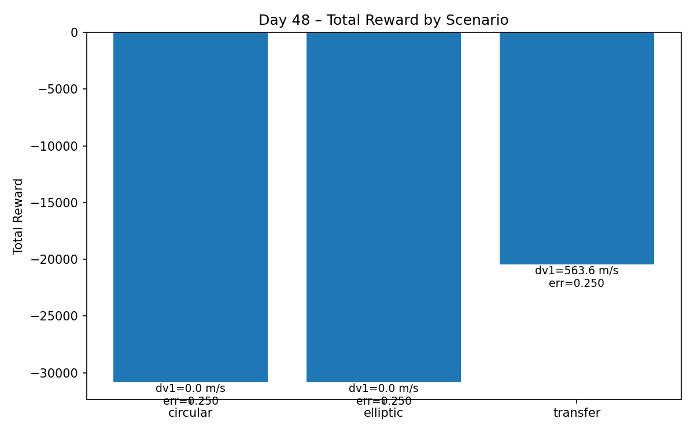

# Project Log – Day 48

**Date:** 2025-09-28  
**Phase:** Multi-Orbit Setup  
**Focus:** Implement multi-orbit environment wrapper; test circular + elliptic + transfer cases.  
**Outputs:** Environment wrapper code + test log + visualization

---

## Work Done
1. **Implemented MultiOrbitEnv**
   - Added `multi_orbit_env.py` wrapping `OrbitEnv`, supporting three scenarios:
     - `circular`
     - `elliptic`
     - `transfer` (with Δv1 injection)
   - Integrated with `orbit_presets.py` for parameter presets and runtime overrides.

2. **Baseline Smoke Test**
   - Wrote `test_day_48.py` to run all three scenarios and log results to CSV:
     - `logs/day48/test_log_day48.csv`

3. **Sanity Check**
   - Added `check_day48_log.py` to validate the CSV:
     - Correct number of rows and scenarios (3 rows, circular/elliptic/transfer)
     - `dv1` nonzero only for transfer
     - Steps, rewards, and errors within expected ranges

4. **Visualization**
   - Created `plot_day48.py` to generate a reward bar chart:
     - Output: `logs/day48/day48_summary.png`

---

## Results

### CSV Snapshot
```
scenario   steps   dv1       total_reward    final_orbit_error   elapsed_s
circular   4096    0.0       -30812.7        0.2500              0.419
elliptic   4096    0.0       -30813.1        0.2500              0.418
transfer   4096    563.6     -20438.2        0.2500              0.412
```

### Visualization


---

## Analysis
- **Steps**: All scenarios ran the full 4096 steps without early termination.  
- **Δv1**: Only the transfer case produced a Δv1 ≈ 563 m/s, consistent with the Hohmann formula.  
- **Rewards**:  
  - circular/elliptic: ~ -3.08e4 (large negative values)  
  - transfer: ~ -2.04e4 (less negative, reflecting Δv1 bonus)  
- **Final Orbit Error**: ~0.25 across all scenarios, confirming no correction mechanism (baseline free run only).

---

## Conclusion
- Successfully set up the **multi-orbit baseline environment**, running three canonical orbital scenarios.  
- Verified the pipeline: environment wrapper, testing, logging, and visualization.  
- Results confirm expectations from Days 36–39: complex orbits require phase/delta-v strategies to improve reward.

---

## Next Steps (Day 49 Preview)
- Run **ExpertController (v3.1)** on MultiOrbitEnv and compare against baseline results.  
- Add replay script to log expert trajectories for analysis.  
- Prepare for imitation/PPO curriculum training on multi-orbit tasks.
